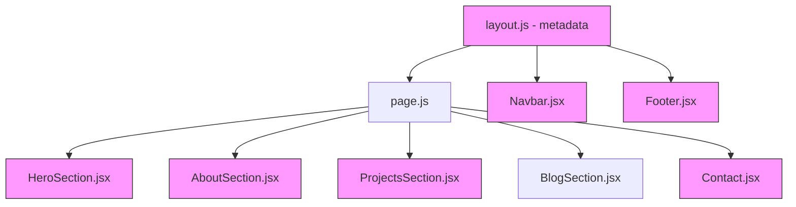

# Design Document: Resume Profile Update

## Overview

This feature updates the existing Next.js portfolio website to reflect the latest resume information. The changes are purely content and configuration updates across existing React components — no new components, routes, or architectural changes are needed. The resume PDF download link will be swapped, and all hardcoded profile data across components will be updated to match the resume.

## Architecture

The existing architecture remains unchanged. The portfolio is a Next.js 14 app with:
- App Router (`src/app/`)
- Client-side components using Framer Motion, react-scroll, and next-themes
- Static data in component files (no CMS or database for profile info)
- EmailJS for the contact form
- Blog data fetched from an API route

All changes are in-place edits to existing files. No new dependencies, routes, or components are required.



Pink nodes = files that need content updates.

## Components and Interfaces

No new components or interfaces are introduced. The following existing components receive content updates:

### HeroSection.jsx
- Update `highlights` array: `["Software Development Engineer", "Full-Stack Developer", "Cloud Engineer"]`
- Update description text to match resume summary
- Change resume link from `/Resume.pdf` to `/Resume - External.pdf`
- Verify social links use `/elprince-dev/`

### AboutSection.jsx
- Update `skillCategories` object with four categories from resume:
  - Languages: TypeScript, Python, JavaScript, HTML/CSS, SQL
  - Frameworks: React 19, tRPC, Node.js, Vitest
  - Cloud & Infrastructure: AWS Lambda, CDK, DynamoDB, S3, CloudFront, EventBridge, SES, SNS, CloudWatch, RUM, WAF, Route 53, IaC
  - Tools: Git, Nx, Vite, ESLint, Prettier
- Update `stats` array: `["4+ Years Experience", "15+ Projects Completed", "20+ Technologies"]`
- Update bio paragraphs to reflect SDE role at Amazon, serverless apps, AWS certifications, education

### ProjectsSection.jsx
- Add "Quality Management Platform" as the first project (no GitHub/live links since Amazon Confidential)
- Update YasMade project description and add YouTube demo link
- Keep existing projects (WriteWell, Portfolio, Modern Landing Page, Budget Tracker CLI)

### Contact.jsx
- Verify email: `mohammad-elprince@proton.me` (already correct)
- Verify location: `Milton, ON, Canada` (already correct)
- Update LinkedIn link to `https://www.linkedin.com/in/elprince-dev/`

### Footer.jsx
- Replace hardcoded `© 2023` with dynamic year using `new Date().getFullYear()`
- Update LinkedIn link to `https://www.linkedin.com/in/elprince-dev/`

### Navbar.jsx
- Verify name displays "Mohammad El Prince" (already correct)

### layout.js
- Update metadata title to "Mohammad El Prince - Software Development Engineer"
- Update metadata description to match resume summary

## Data Models

No data model changes. All profile data is hardcoded in component files as JavaScript objects/arrays. The project data structure in `ProjectsSection.jsx` already supports optional `github` and `link` fields (the Quality Management Platform will have neither).

The existing project object shape:
```javascript
{
  name: string,
  image: string,
  description: string,
  problem: string,
  solution: string,
  techStack: string[],    // SVG/PNG filenames in /public
  github: string,         // empty string for confidential projects
  link: string,           // empty string if no live link
  metrics: { duration: string, linesOfCode: string, techCount: string },
  highlights: string[]
}
```

For the Quality Management Platform, new tech stack icons may be needed (e.g., `typescript.svg`, `dynamodb.svg`). If SVGs aren't available in `/public`, we'll use text-based tech labels or skip the icon display for missing ones.


## Correctness Properties

*A property is a characteristic or behavior that should hold true across all valid executions of a system — essentially, a formal statement about what the system should do. Properties serve as the bridge between human-readable specifications and machine-verifiable correctness guarantees.*

This feature is a content update — all acceptance criteria verify specific hardcoded values matching the resume. There are no algorithmic transformations, serializers, parsers, or stateful logic being introduced. All criteria are best validated as example-based tests (checking specific rendered content against expected values).

No universally quantified properties apply to this feature. All testing will be example-based unit tests verifying correct content rendering.

## Error Handling

- If the resume PDF file `/Resume - External.pdf` is missing from `/public`, the download button will result in a 404. No runtime error handling is needed since this is a static file served by Next.js.
- If tech stack SVG icons for new skills (e.g., `typescript.svg`, `dynamodb.svg`) are missing from `/public`, the `<Image>` component will show a broken image. The implementation should either add the missing icons or use a text fallback.
- The Quality Management Platform project has no GitHub or live link. The existing `ProjectsSection` code already handles empty `link` strings by conditionally rendering the link icon. We need to verify it also handles an empty `github` string gracefully.

## Testing Strategy

Since this is a content-only update with no new logic, testing focuses on verifying correct content rendering:

- **Unit tests**: Verify that each component renders the expected content (titles, links, skills, project names, etc.)
- **No property-based tests**: There are no universal properties to test — all criteria are specific value checks
- **Manual verification**: Visual review of the site after changes to confirm layout and styling are intact

Testing framework: The project uses Next.js with React. Tests can use the existing ESLint setup for static analysis. For unit tests, if a testing framework is added, Vitest with React Testing Library would be appropriate given the project's existing use of Vite-adjacent tooling.

Given the nature of this feature (content updates to hardcoded values), the primary validation method is code review and visual inspection rather than automated testing.
